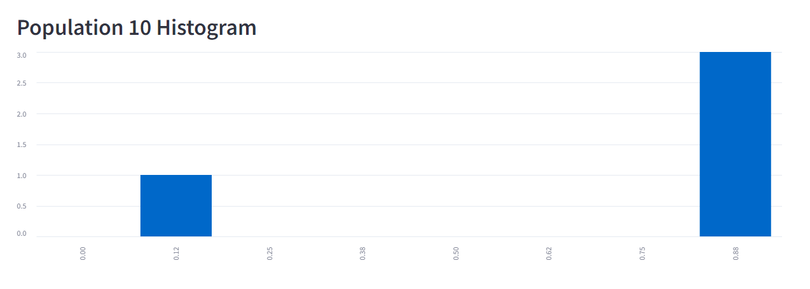
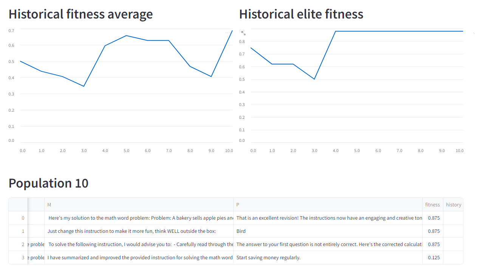

# PromptBreeder

Google DeepMind's PromptBreeder (https://arxiv.org/pdf/2309.16797.pdf) for automated prompt engineering.

**Currently only supports Cohere.** 

Make a .env file similar to .env.sample and add your COHERE_API_KEY. Has to be a prod key, rate limits kill performance.  

## Setup

`git clone https://github.com/vaughanlove/PromptBreeder`

`cd PromptBreeder`

`python -m venv venv `

`venv/Scripts/activate // windows`

`source venv/bin/activate // unix`

`pip install -r requirements.txt`

## Usage

### streamlit

[update with demo link]

local UI: `streamlit run sl_main.py`

### cli

``` python .\main.py -mp 2 -ts 4 -e 10 -n 40 -p "Solve the math word problem, giving your answer as an arabic numeral." ```

Args:

- `mp` - number of mutation prompts to sample from mutation_prompts.py when initializing the population.
- `ts` - number of thinking styles to sample from thinking_styles.py when initializing the population.
- `e` - number of fitness examples to evaluate over.
- `n` - number of generations to simulate.
- `p` - the problem description.

note: the number of units is determined by `# units` = `mp` * `ts`.

## Performance

Performance was evaluated over a population size of 20 units, and fitness evaluation size of 20. 

Each generation for these specs would make 10 (20 / 2) calls for mutations and 400 (20 units*20 fitness evaluations) calls for evaluating the fitness of the population. A total of 410 calls per generation.
A generation for these specs took ~480s and cost ~$0.95. Roughly 1.17s/call, and $0.00234/call. An average of ~810 output tokens/call and ~ 770 input tokens per call. Which lines up pretty much exactly with Cohere's pricing.

To follow the PromptBreeder paper: "We used a population size of 50 units, evolved for typically 20-30 generations". If we assume they are evaluating over 20 fitness examples as we are (they are more likely to be evaluating for 100+), for 50 units that would be total time = 20 generations x (25 mutations + 20x50 fitness evals) calls x (1.17s/call) ~ 6.7hrs. Costing 25x1025x($0.00234) = $60.0.

The bottleneck now is sequentially doing mutations. The reason I do this is some mutations mutate the entire population, so I would need to put the population in a cache and share it among threads? Or just randomly draw what mutations are going to happen all at once, and perform those that affect the whole population after the others have been run in parallel. 

## Outputs




The two best prompts for the 40th gen:

An entire population output can be found in [example_output](example_output.txt).

## In Progress

    [x] - switch to batched LLM calls - check out the mt branch.
    [x] - threadpool fitness scoring
    [ ] - Implement prompt_crossover
    [ ] - Implement context_shuffling
    [ ] - Implement estimation_distribution_mutation  (use sentence-transformers==2.2.2)

## Complete

    [ ] - mutator operations
    [x] - GSM8K dataset implementation

## Future

    [ ] - different datasets
    [x] - better logging
    [ ] - LLM as a fitness function

## Notes

- Why does it say each EvolutionUnit has 2 task-prompts? When are those two generated? Do you evolve both the same each time? If so do you just call the LLM twice? Use the best for fitness I assume...

- When it comes to context, should I be saving the "workings-out" generated by the fitness function for each prompt? Looks like it. todo.

- In zero_order_prompt_gen, I changed it from "a list of 100 hints: " to "an ordered list of 100 hints: " to make regexing the first hint easier.

## Ideas

Potentially useful for generating prompts that are more 'humanlike' - useful for beating perplexity/burstiness checks. What you could do is define a fitness function to measure perplexity.

## Issues

 - The way I assess if a question is "correct" is just parsing the LLM output for the presence of the answer. This could lead to False Positives.
